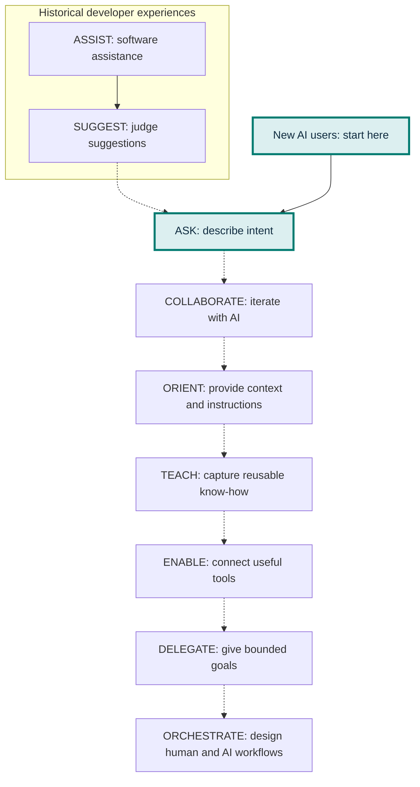
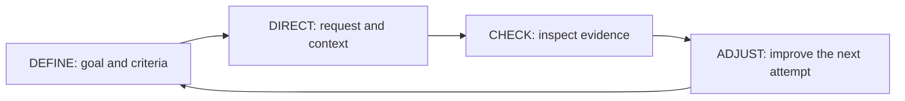
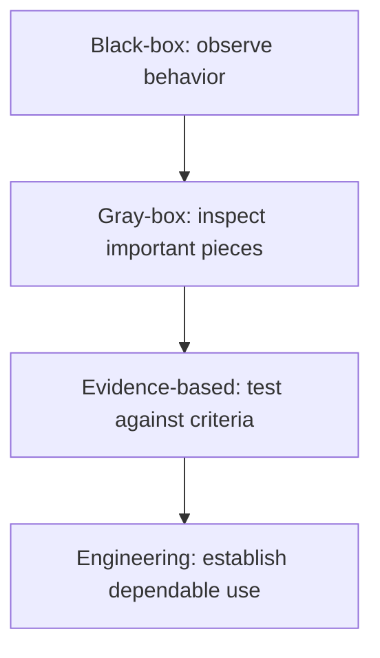

# From Autocomplete to Agentic Engineering

AI did not suddenly take us from writing code to autonomous agents. For decades, our tools have taken on progressively more work. What changes is what the human provides—and how much work happens before we check the result.

Start where you are. Move one step.

## You Don’t Have to Start at the Beginning

Traditional developers may have experienced ASSIST → SUGGEST → ASK as their tools evolved. That history is one path into working with AI. It is not a required course of study.

A new AI user can begin directly at **ASK**, using everyday language. You do not need coding experience or familiarity with an integrated development environment (IDE) to begin learning.

**Historical / traditional developer journey:** ASSIST → SUGGEST → ASK
ASSIST and SUGGEST describe earlier tool experiences, not prerequisites.

↓ New AI users can enter at ASK

**ASK** → COLLABORATE → ORIENT → TEACH → ENABLE → DELEGATE → ORCHESTRATE

Start with the practice that fits your task. Move among these practices as you learn; the progression is not a prerequisite chain.

The dotted connections show practices you can explore. Move among them as needed; they are not prerequisites or a maturity ranking.

## The progression

This is a learning progression for the human, not simply a list of AI technologies. It describes practices you can grow into and return to—not prerequisites you must complete in order.

- **ASSIST:** Autocomplete, syntax highlighting, IntelliSense

- **SUGGEST:** Predictive and whole-line code completion

- **ASK:** Natural-language prompting and LLM chat

- **COLLABORATE:** Iterative conversation and vibe coding

- **ORIENT:** Context, repository knowledge, AGENTS.md

- **TEACH:** Reusable skills and procedures

- **ENABLE:** Tools, shell, APIs, MCP, tests

- **DELEGATE:** Agents own bounded goals

- **ORCHESTRATE:** Human + AI workflows

The major LLM shift: we moved from the computer predicting **what I was going to type** to working from **what I am trying to accomplish.**

### Find yourself on the line

This is a learning map, not a maturity score. You do not need to reach ORCHESTRATE. Identify what you can use confidently and repeatedly, what you have tried, and what would help your work next.

- **ASSIST** I use software assistance

- **SUGGEST** I judge suggestions

- **ASK** I describe intent

- **COLLABORATE** I iterate with AI

- **ORIENT** I provide context & instructions

- **TEACH** I capture reusable know-how

- **ENABLE** I connect useful tools

- **DELEGATE** I give bounded goals

- **ORCHESTRATE** I design human + AI workflows

**Comfortable:** I can do this repeatedly

**Experimented:** I have tried this

★ **Next:** I want to learn this

**Where am I comfortable today?** Mark practices you can use intentionally and repeatably—not simply something you tried once.

**What have I experimented with?** Trying an agent does not automatically make someone “advanced.” Experimentation is part of learning.

**What would help me next?** Choose the next practice that helps you do real work better. It may not be the farthest step on the line.

## The human loop never goes away

Define → Direct → Check → Adjust is the universal loop. Evaluation is not the final stage. It is present from the beginning—whether you are a first-time AI user, a vibe coder, an experienced engineer, or someone orchestrating agents.

**DEFINE → DIRECT → CHECK → ADJUST → Repeat**

What changes is the amount and complexity of work that happens between **Direct** and **Check**—and the strength of the evidence needed to trust the result.

## Checking grows with you

CHECK is not synonymous with “review the code.” You can start by observing what the result does, then learn to inspect its important pieces and test it more systematically.

> “What would convince me this is right?”

You don’t have to understand every line of code to begin checking. Start with behavior you can observe. As capability and stakes increase, **the strength of the evidence should increase too.**

Each layer includes the earlier checks. Choose the evidence your task requires; every exercise does not need production-level engineering checks.

### Black-box behavior check

Does it do what I wanted?

Use the result and compare its observable behavior with your intent. You do not need to understand its internal implementation to begin.

**Example:** Add an item to a checklist, mark it complete, and confirm that the completed count changes correctly.

### Gray-box understanding & inspection

Can I understand the important pieces?

Ask AI to explain what it did. Inspect relevant inputs, outputs, logs, settings, behavior, or small pieces of code. Use the explanation to guide inspection; the explanation alone is not proof.

**Example:** Find out where checklist items are stored, then reload the page to see whether the result matches that explanation.

### Evidence-based check

Can I test it systematically?

Use acceptance criteria, test cases, comparisons with known results, or another person’s review. Record expected and actual outcomes, including cases where something might go wrong.

**Example:** Check empty items, long labels, repeated clicks, and reloading against written requirements. Ask someone else to try the workflow.

### Engineering check

Is it fit for dependable use?

Check automated test results and assess security, maintainability, reliability, performance, and architectural soundness. Use appropriate expert review and evidence tied to the intended use.

**Example:** Before launching a shared checklist service, test access controls, concurrent edits, recovery after failures, and expected load.

Each level builds on the earlier checks. These are learning steps, not mutually exclusive categories: engineering checks still include observable behavior and systematic evidence.

**“It looks like it works” is a starting observation, not sufficient evidence for every use.** As the work becomes more consequential, strengthen the checks. When the required checks exceed your current skills, involve a qualified reviewer or keep the use limited until you have adequate evidence.

### A personal prototype

Start small, use sample data, and check observable behavior. Keep the experiment reversible, note its limits, and learn from what happens.

### A production system

Require stronger evidence before relying on it: systematic tests, appropriate expert review, and checks for the failure modes that matter in real use.

Define something small → Direct AI → Check observable behavior → Adjust → Repeat

The same habit works for writing, research, planning, and code. Choose evidence that fits the task and its stakes.

## Define does not mean “write the complete spec”

Often we do not yet know exactly what we want. Definition can begin with enough understanding to take the next useful step.

### Discover

Explore the problem, users, possibilities, constraints and unknowns. Use AI to question assumptions and expose options.

### Define

State what is known now: intent, desired outcome, boundaries and the next thing worth learning.

### Specify

As knowledge increases, capture requirements, architecture, acceptance criteria and interfaces with greater precision.

Idea → Intent → Exploration → Prototype → Requirements → Specification → Implementation

**A spec can be an output of learning—not a prerequisite for learning.**

## This is familiar: Agile was solving the same uncertainty

### Traditional / Plan-driven

Understand → Specify → Design → Build → Test → Deliver

Works best when enough can be known and stabilized before implementation.

### Agile

Intent → Build → Feedback → Learn → Adjust → Repeat

Build enough to learn what should be defined next.

### AI / Agentic Engineering

Intent → AI Builds → Human Checks → Learn → Redirect → Repeat

The learning loop can become dramatically faster, but verification remains essential.

## What actually changes?

The fundamental engineering problem—learning what should be built—remains. AI compresses the cost and time of trying, seeing and adjusting.

### Early tools

**You type.**
I help you finish it.

### LLM collaboration

**You express intent.**
We explore and build together.

### Agentic engineering

**You provide goals and boundaries.**
The agent can plan, act, use tools and return evidence for review.

Agentic engineering does not replace Agile's lesson. It can **accelerate the build → learn → define loop** while preserving human judgment.

## Start where you are. Move one step.

Ask: **“What would convince me this is right?”**
Check at the level you can—and strengthen how you check as the work becomes more consequential. The goal is not to reach the end of the line; it is to use the right practices for the work in front of you.
